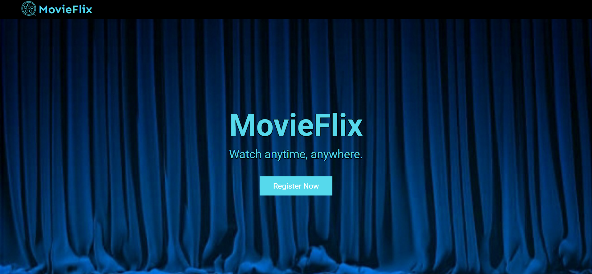
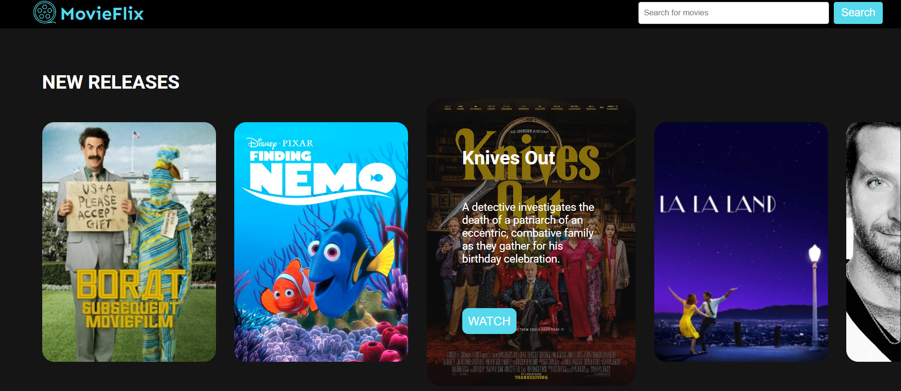
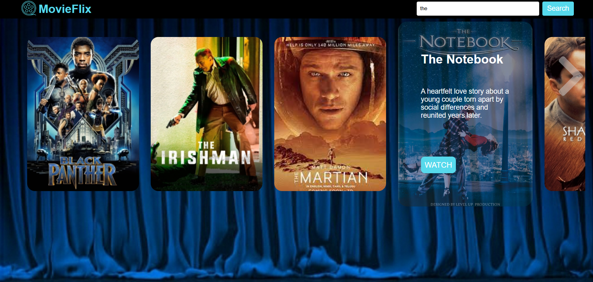
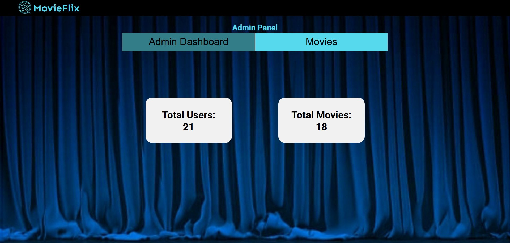
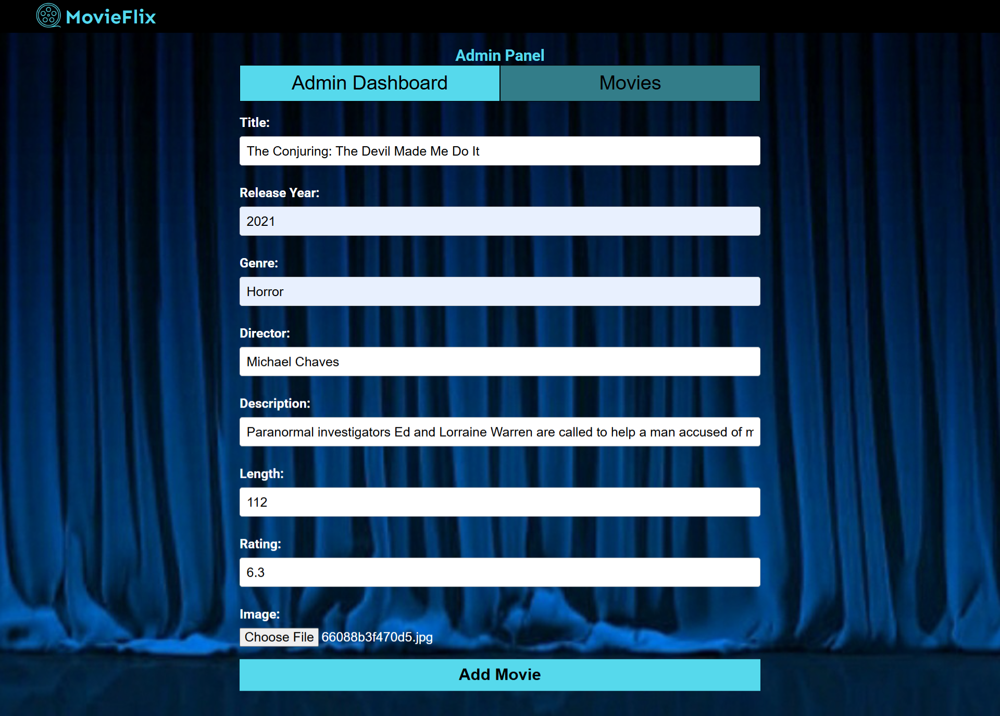

# 🎬 MovieFlix – Movie Web App

🌐 **Live Site:** [http://movieflix.infinityfreeapp.com](http://movieflix.infinityfreeapp.com/home.php)

**MovieFlix** is a full-featured web application built with **HTML, CSS, JavaScript, PHP and MySQL**. It provides functionality for browsing, searching, and managing movies.

---

## ✨ Features

- 🔐 **Register and Login**
  Register yourself as an admin or customer, or login with an existing account.

- 🔍 **Browse and Search Movies**  
  Browse and search movies by title.

- 📊 **Admin Dashboard**  
  Get a quick overview with total users and total movies.

- 🎞️ **Movie Management**  
  Add movies — complete with details like title, genre, description, and release year.

- 👥 **User Management**  
  View registered users.

---

## 🧰 Tech Stack

- **Frontend:** HTML, CSS, JavaScript  
- **Backend:** PHP  
- **Database:** MySQL  

---

## 📦 Installation & Setup

### ⚠️ Prerequisites
- PHP 7.x or above
- MySQL Server
- XAMPP
- A web browser

### 🛠️ Steps

1. **Go to your web server directory:**
```bash
cd C:\xampp\htdocs\
```

2. **Clone the repository:**
```bash
git clone https://github.com/saradotdev/MovieFlix.git
```

3. **Set up the database:**
   - Open **phpMyAdmin**.
   - Create a new database: `movieflix`
   - Import the provided SQL file from the project root into phpMyAdmin.
     ```bash
     movieflix.sql
     ```

4. **Configure DB credentials:**
   - Open `connection.php`.
   - Update the host, username, password, and database name as per your setup.

5. **Run the application:**
   - Start your local server (Apache + MySQL)
   - Visit in browser:
     ```
     http://localhost/MovieFlix/
     ```

### 🔑 Demo Login
- **Admin:** admin@example.com / password123
- **Customer:** user@example.com / password123

---

## 📸 UI Preview

### 👋 Welcome


### 🏠 Home


### 🎬 Movie Catalogue


### 🔍 Search Functionality


### 👤 Admin Dashboard


### 🎥 Add Movie


---

## 📬 Contact

If you’d like to contribute or have questions:

- **GitHub:** [@saradotdev](https://github.com/saradotdev)

---
